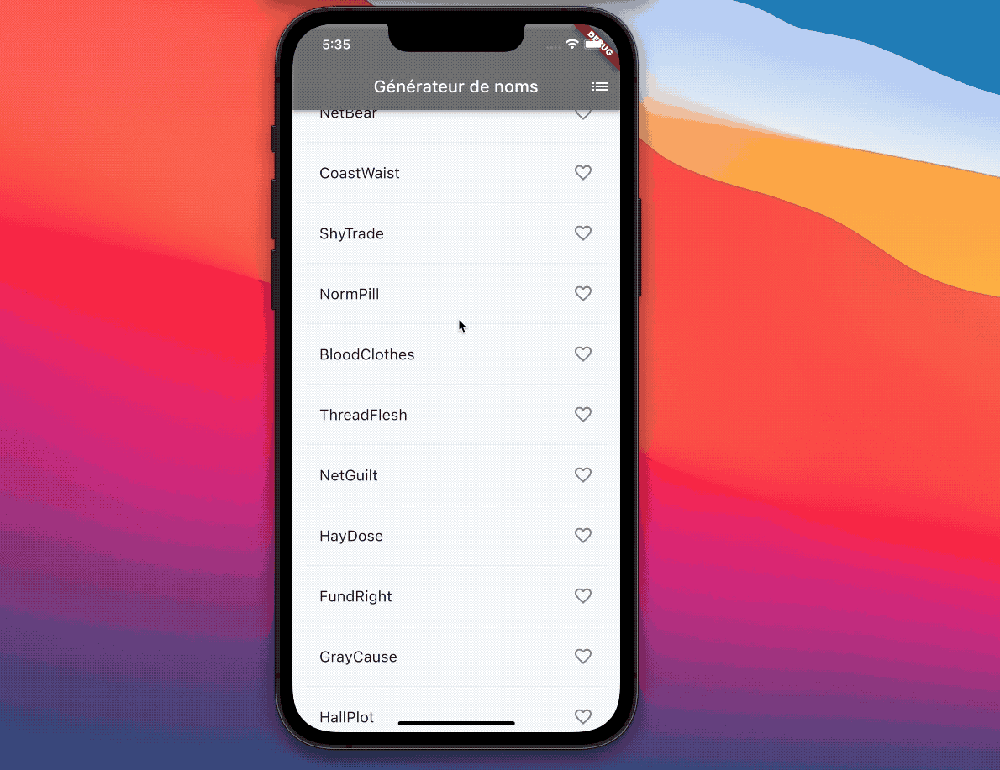

#  Générateur de noms d'entreprise

> Tutoriel proposé par Google (https://codelabs.developers.google.com/codelabs/first-flutter-app-pt1#0)

Une application simple qui génère des noms d'entreprise. L'utilisateur pourra sélectionner et désélectionner les propositions, afin d'enregistrer celles qu'ils préfèrent. Le code génère 10 noms à la fois. À mesure que l'utilisateur fait défiler la page, d'autres noms sont générés. Le défilement est infini.

Le fichier GIF animé suivant montre le fonctionnement de l'application à la fin de cette partie de l'atelier :

